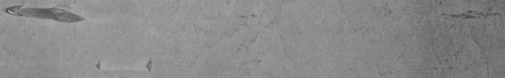
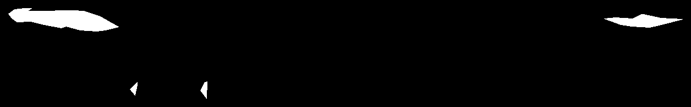
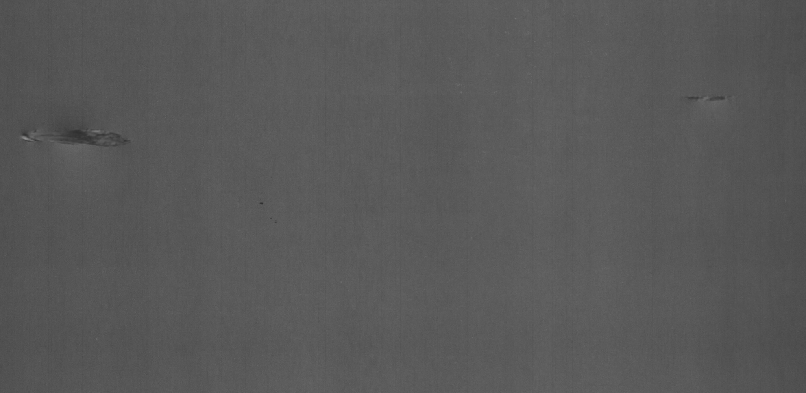

# ⚡ Synthetic Defect Generator

<p align="center">
  <em>Công cụ hỗ trợ khởi tạo dữ liệu huấn luyện lỗi tổng hợp (Synthetic Defect Training Data).</em>
</p>

## 🌟 Giới thiệu

**Synthetic Defect Generator** là một ứng dụng Desktop được phát triển bằng PyQt5, OpenCV và NumPy. Công cụ này sinh ra để giải quyết bài toán thiếu hụt dữ liệu lỗi (NG - No Good) trong việc huấn luyện các mô hình AI/Computer Vision. 

Thay vì phải tốn nhiều công sức thu thập ảnh lỗi thực tế trên dây chuyền, bạn có thể cắt trích xuất các mảng lỗi từ một số ít ảnh có sẵn, sau đó **hòa trộn (blend)** chúng vào các ảnh sản phẩm bình thường (OK) để tạo ra tập dữ liệu đa dạng và chân thực.

## ✨ Tính năng chính

### 1. ✂️ Cut Mask NG (Trích xuất mảng lỗi)
- Giao diện trực quan cho phép vẽ đa giác (polygon) bao quanh vùng lỗi trên ảnh NG.
- Trích xuất vùng lỗi (kèm mask alpha trong suốt) và lưu thành một hình ảnh riêng biệt.
- Cung cấp tính năng thu phóng (zoom) và kéo (pan) để thao tác cắt chính xác đến từng pixel.

<p align="center">
  
  
  <br>
  <i>(Kết quả trích xuất: Mảng lỗi và Mask tương ứng)</i>
</p>

### 2. 🎨 Blend Defect Into OK (Hòa trộn lỗi vào ảnh bình thường)
- Khung nhìn tương tác (Interactive Canvas) cho phép dễ dàng kéo thả (drag & drop) mảng lỗi trực tiếp lên bề mặt ảnh OK.
- Hiển thị hình ảnh theo đúng tỷ lệ khung hình thực (Native Aspect Ratio), không bị méo lệch.
- Xử lý mượt mà việc kết hợp vùng lỗi vào bề mặt mới.

<p align="center">
  
  <br>
  <i>(Kết quả hoàn chỉnh sau khi hòa trộn mảng lỗi vào bề mặt ảnh)</i>
</p>

## 🚀 Cài đặt

**Yêu cầu môi trường:** Python 3.8 trở lên.

1. **Clone mã nguồn (hoặc tải xuống):**
   ```bash
   git clone https://github.com/dloc19/Synthetic_Defect_Tool.git
   cd Synthetic_Defect_Tool
   ```

2. **Cài đặt thư viện yêu cầu:** (Khuyến nghị tạo Virtual Environment trước khi cài)
   ```bash
   pip install -r requirements.txt
   ```
   *Các thư viện lõi bao gồm: `PyQt5`, `opencv-python`, `numpy`.*

## 💻 Hướng dẫn sử dụng

Khởi chạy ứng dụng bằng cách chạy lệnh sau tại thư mục gốc của dự án:

```bash
python main.py
```

1. Tại **Main Menu**, chọn công cụ phù hợp với quy trình của bạn.
2. **Cut Mask NG**: Mở ảnh lỗi -> Dùng chuột click để vẽ đa giác quanh vùng lỗi -> Lưu Patch lỗi (kèm mask).
3. **Blend Defect Into OK**: Tải bức ảnh nền (OK) -> Tải Patch lỗi vừa cắt -> Kéo thả chọn vị trí mong muốn -> Nhấn nút hòa trộn/lưu ảnh để trích xuất ảnh lỗi tổng hợp cuối cùng.

## 📂 Cấu trúc dự án

```text
Synthetic_Defect_Tool/
├── assets/             # Lưu trữ icon và ảnh demo cho dự án
├── core/               # Thư mục xử lý thuật toán, xử lý tính toán OpenCV/NumPy
├── dataset/            # Thư mục mẫu chứa tập ảnh OK, NG và ảnh kết quả
├── gui/                # Module UI chính của ứng dụng
│   ├── main_menu.py
│   ├── blend_window.py
│   ├── cut_mask_window.py
│   └── theme.py
├── utils/              # Các hàm tiện ích đa dụng (utility)
├── main.py             # Entry point để chạy ứng dụng
└── requirements.txt    # Danh sách các package Python cần thiết
```

## 👨‍💻 Tác giả

Dự án được phát triển bởi **dloc19** (2026).
